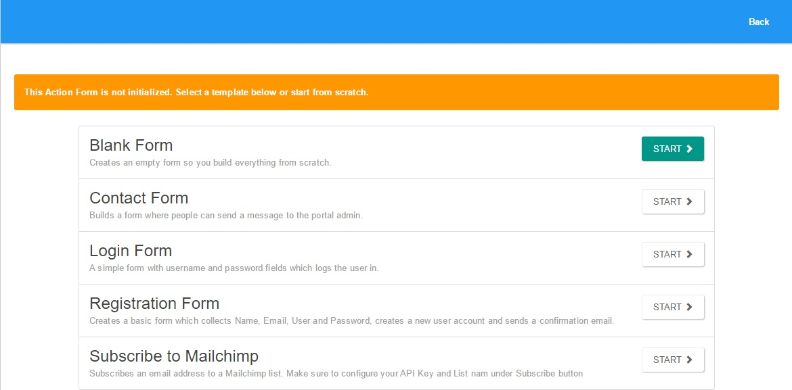
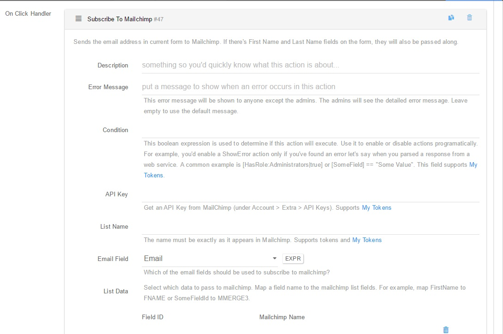
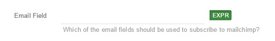
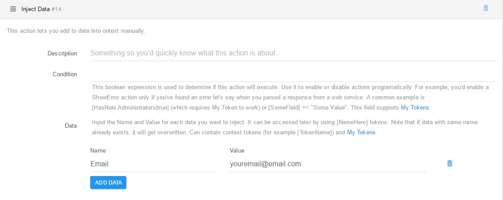
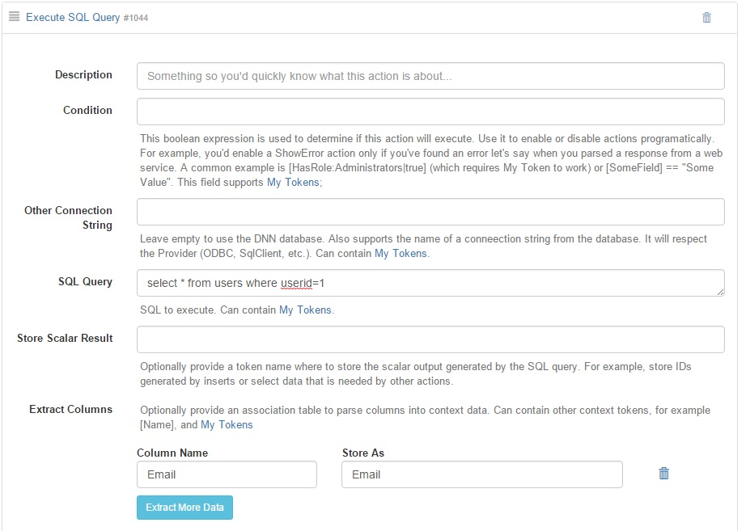

# Subscribe

You can subscribe to Mailchimp with our add-on as follows:

**Action Form**

Action Form comes with a Subscribe to Mailchimp template, which has a few predefined fields and actions: First Name, Last Name, Email, Subscribe to Mailchimp, and Display Message.

**Action Grid, DNN API Endpoint**

The Subscribe to Mailchimp action is basically the same in all the supported modules, with a few slight differences.

Whereas in Action Form, Action Grid, and DNN API Endpoint you can use either a text box field or expression to determine which email will be used to subscribe

in **Sharp Scheduler and InfoBox**, the email must be determined by ways of inject data or SQL query, for example.

The resulting Email token is then used in the Subscribe to Mailchimp Email field.

It is worth noting that in InfoBox, the Subscribe to Mailchimp action is a button action.